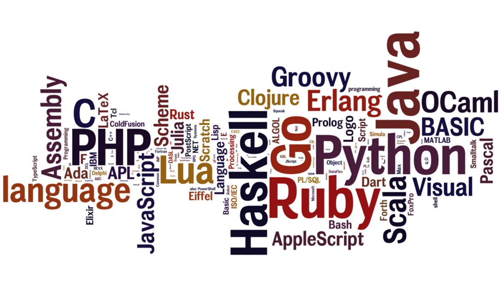

##  Hola, mi nombre es Abraham Plata 👋

Administrador de Sistemas informaticos en Red
  

 

Actualmente estudio administrador de sistemas informaticos en red cursando el segundo y ultimo año, y también estoy estudiando por mi cuenta programación. 
Desde 2016 trabaje de Administrador, coordinador y técnico en la fibra óptica en compañias como vodafone, masmovil o orange desde la empresa de circet españa, pero siempre me ha interesado lo que estudio ahora y el desarrollo web o de apliacaciones. 
En mi github voy a subir todo lo que vaya haciendo sobre mis estudios y proyectos de cualquier modulo o tipo de lenguaje, espero que si alguien encuentra información útil aquí pueda informarme a traves de mi correo que está en mi bio. 
Tengo un canal de youtube, que siempre que pueda subire tutoriales a modo de enseñar lo que se, espero que os guste si lo veis, un saludo.

<!--
**Plata20/Plata20** is a ✨ _special_ ✨ repository because its `README.md` (this file) appears on your GitHub profile.

Here are some ideas to get you started:

- 🔭 I’m currently working on ...
- 🌱 I’m currently learning ...
- 👯 I’m looking to collaborate on ...
- 🤔 I’m looking for help with ...
- 💬 Ask me about ...
- 📫 How to reach me: ...
- 😄 Pronouns: ...
- ⚡ Fun fact: ...
-->
